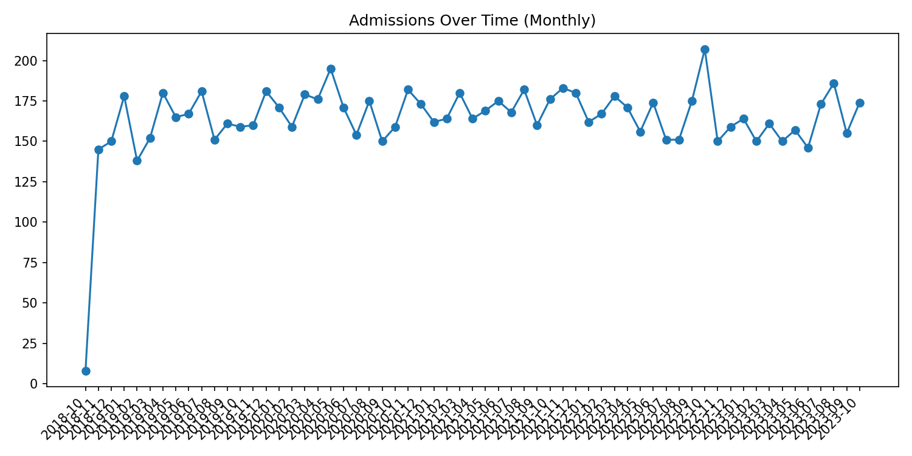

---
# Healthcare Data Lifecycle Mini Project

## 📌 Project Overview
This mini project demonstrates a **data lifecycle pipeline** (from data capture → cleaning → analysis → visualization) for the **healthcare domain**.  
The dataset contains records of ~10,000 patients with attributes such as **Name, Age, Gender, Blood Type, Medical Condition, Admission Date, Doctor, Hospital, Insurance Provider, and Billing Amount**.

The main goal is to explore healthcare trends and provide insights using **Python (Pandas, Matplotlib, Seaborn)**.

---

## ⚙️ Steps in Data Lifecycle

1. **Data Capture**  
   - Downloaded a healthcare dataset (55k patient records) from Kaggle.  
   - Stored as `healthcare_dataset.csv`.

2. **Data Cleaning & Preprocessing**  
   - Removed duplicates, handled missing values, standardized column names.  
   - Converted admission date into a proper datetime format.  
   - Derived new columns (e.g., `Age Group`, `Month of Admission`).

3. **Data Storage**  
   - Saved cleaned & derived datasets into CSV files inside `/metrics`.

4. **Data Analysis & Visualization**  
   Generated insights:
   - Admissions over time (monthly trends).  
   - Age group distribution.  
   - Gender distribution.  
   - Blood type distribution.  
   - Average billing by blood type & condition.  
   - Top 10 medical conditions.  
   - Insurance provider market share.

   All visualizations saved in `/figures`.

5. **Insights & KPIs**  
   - Tracked total patients, average billing, and number of hospitals.  
   - Identified most common medical conditions and costly treatments.  
   - Observed demographic distribution (age, gender, blood type).

---

## 📊 Key Visualizations

- **Admissions Over Time**   
- **Age Group Distribution**   
- **Top 10 Medical Conditions**   

(See `/figures` folder for more)

---

## 📑 Metrics (CSV Outputs)

- `admissions_by_month.csv` → Monthly patient admissions.  
- `avg_billing_by_bloodtype.csv` → Average billing by blood type.  
- `avg_billing_by_condition.csv` → Average billing by medical condition.  
- `blood_type_counts.csv` → Count of each blood type.  
- `medical_condition_counts.csv` → Count of medical conditions.  
- `kpis.csv` → Key performance indicators (patients, hospitals, avg billing).

---

## 🚀 Tools & Technologies
- Python 3.x  
- Pandas  
- Matplotlib  
- Seaborn  
- VS Code  

---

## 📌 How to Run
1. Clone this repo:  
   ```bash
   git clone https://github.com/YourUsername/healthcare-project.git
   cd healthcare-project

**Author:** Manasi Jitendra Patil  